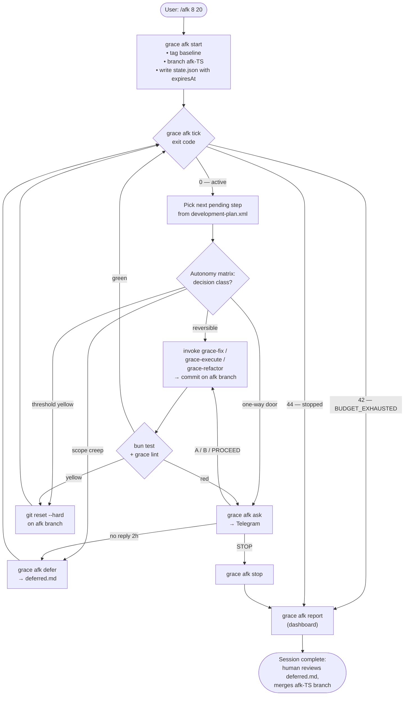

# GRACE Marketplace and CLI

**GRACE** means **Graph-RAG Anchored Code Engineering**: a contract-first AI engineering methodology built around semantic markup, shared XML artifacts, verification planning, and knowledge-graph navigation.

This repository ships the GRACE skills plus the optional `grace` CLI. It is a packaging and distribution repository, not an end-user application.

Current packaged version: `3.7.0`

## What This Repository Ships

- Canonical GRACE skills in `skills/grace/*`
- Packaged Claude marketplace mirror in `plugins/grace/skills/grace/*`
- Marketplace metadata in `.claude-plugin/marketplace.json`
- Packaged plugin manifest in `plugins/grace/.claude-plugin/plugin.json`
- OpenPackage metadata in `openpackage.yml`
- Optional Bun-powered CLI package `@osovv/grace-cli`

The published CLI currently gives you:

- `grace lint` for integrity checks
- `grace module find` for module resolution across shared docs and file-local markup
- `grace module show` for shared/public module context
- `grace file show` for file-local/private implementation context

## Why GRACE

GRACE is designed for AI-assisted engineering where agents need stable navigation, explicit contracts, and reusable verification evidence.

Core ideas:

- shared artifacts define the public module boundary
- file-local markup defines private implementation detail
- contracts describe expected behavior before code changes spread
- verification is planned, named, and reused instead of improvised per task
- semantic blocks give agents precise read and patch targets

This makes it easier to:

- plan modules and execution order
- hand work across agents without losing context
- review for drift between code, graph, and verification
- debug failures from named blocks and planned evidence

GRACE was designed by Vladimir Ivanov ([@turboplanner](https://t.me/turboplanner)).

## Install

Install **skills** first.

- Skills are the core GRACE product surface.
- The CLI is optional, but highly recommended once the skills are installed.
- Installing only skills is a valid setup.
- Installing only the CLI is usually not useful without the GRACE skills and workflow.

### Install Skills

Skills and CLI are complementary, but they are distributed differently.

#### OpenPackage

```bash
opkg install gh@osovv/grace-marketplace
opkg install gh@osovv/grace-marketplace -g
opkg install gh@osovv/grace-marketplace --platforms claude-code
```

#### Claude Code Marketplace

```bash
/plugin marketplace add osovv/grace-marketplace
/plugin install grace@grace-marketplace
```

#### Agent Skills-Compatible Install

```bash
git clone https://github.com/osovv/grace-marketplace
cp -r grace-marketplace/skills/grace/grace-* /path/to/your/agent/skills/
```

### Install CLI

The CLI is a companion to the GRACE skills, not a replacement for them.

Requires `bun` on `PATH`.

```bash
bun add -g @osovv/grace-cli
grace lint --path /path/to/grace-project
```

## Quick Start

For a new GRACE project:

1. Run `$grace-init`
2. Design `docs/requirements.xml` and `docs/technology.xml` together with your agent
3. Run `$grace-plan`
4. Run `$grace-verification`
5. Run `$grace-execute` or `$grace-multiagent-execute`

For an existing GRACE project, the CLI is often the fastest way to orient yourself:

```bash
# Integrity gate
grace lint --path /path/to/project

# Resolve the relevant module
grace module find auth --path /path/to/project
grace module find src/provider/config-repo.ts --path /path/to/project --json

# Read shared/public context
grace module show M-AUTH --path /path/to/project
grace module show M-AUTH --path /path/to/project --with verification

# Read file-local/private context
grace file show src/auth/index.ts --path /path/to/project
grace file show src/auth/index.ts --path /path/to/project --contracts --blocks
```

## Skills Overview

| Skill | Purpose |
| --- | --- |
| `grace-bootstrap` | Activation protocol — runs first in any GRACE-managed repo, routes intent to the right skill, blocks edits until project context is loaded |
| `grace-init` | Bootstrap the GRACE docs, templates, and agent guidance (plus optional `CLAUDE.md`, SessionStart hook, and `.grace-afk.json`) |
| `grace-plan` | Design modules, phases with checkpoints, flows, dependencies, and contracts |
| `grace-verification` | Build and maintain `verification-plan.xml`, tests, traces, and log evidence |
| `grace-execute` | Execute the plan sequentially with scoped review and commits |
| `grace-multiagent-execute` | Execute parallel-safe waves with controller-managed synchronization, Wave Success Thresholds, and a Pre-Wave Checklist |
| `grace-refactor` | Rename, move, split, merge, and extract modules without shared-artifact drift |
| `grace-fix` | Debug using the Prove-It Pattern: failing test first, then fix, then regression entry |
| `grace-refresh` | Refresh graph and verification artifacts against the real codebase |
| `grace-reviewer` | 5-axis integrity review (Completeness / Contractual / Semantic / Verification / Graph) with Critical/Important/Suggestion/FYI labels |
| `grace-status` | Report overall project health and suggest the next safe action |
| `grace-ask` | Answer questions with progressive context disclosure (4-level hierarchy) |
| `grace-cli` | Use the optional `grace` binary as a fast lint and artifact-query layer for GRACE projects |
| `grace-explainer` | Explain the GRACE methodology itself |
| `grace-setup-subagents` | Scaffold shell-specific GRACE worker and reviewer presets |
| `grace-afk` | Autonomous harness for unattended work — `/afk [hours] [budget%]` runs the plan on an isolated branch with CLI-enforced budget and Telegram escalation |
| `grace-ask-human` | Short-form Telegram escalation for one-way-door decisions inside a `grace-afk` session |

## CLI Overview

| Command | What It Does |
| --- | --- |
| `grace lint --path <root>` | Validate current GRACE artifacts, semantic markup, unique XML tags, export/map drift, and SKILL.md discipline sections |
| `grace module find <query> --path <root>` | Search by module ID, name, path, purpose, annotations, dependency IDs, verification IDs, and `LINKS` |
| `grace module show <id-or-path> --path <root>` | Show the shared/public module record from plan, graph, steps, and linked files |
| `grace module show <id> --with verification --path <root>` | Include verification excerpt when a `V-M-*` entry exists |
| `grace file show <path> --path <root>` | Show file-local `MODULE_CONTRACT`, `MODULE_MAP`, and `CHANGE_SUMMARY` |
| `grace file show <path> --contracts --blocks --path <root>` | Include scoped contracts and semantic block navigation |
| `grace status [--brief] [--path <root>]` | Artifact presence, module count, verification coverage, pending steps, next recommended action. `--brief` is `≤30` lines for SessionStart hooks |
| `grace afk start <hours> [<budget%>] [--checkpoint <min>]` | Start an autonomous session — creates isolated branch + `state.json` with `expiresAt` |
| `grace afk tick` | CLI-side active-session gate. Exits `42 BUDGET_EXHAUSTED`, `43 NO_SESSION`, `44 SESSION_STOPPED`. The agent polls between every step |
| `grace afk ask / check` | Send a Telegram escalation (needs `.grace-afk.json`), poll for reply |
| `grace afk journal / defer / increment` | Append structured entries to `docs/afk-sessions/<id>/{decisions,deferred}.md` and update counters |
| `grace afk report / stop` | Emit the return dashboard / manually stop a session |

Current output modes:

- `grace lint`: `text`, `json`
- `grace module find`: `table`, `json`
- `grace module show`: `text`, `json`
- `grace file show`: `text`, `json`
- `grace status`: `text`, `json` (with `--brief` for compact mode)
- `grace afk ask / check`: `json`

## Autonomous Workflow (`/afk`)

The `grace-afk` skill turns idle time into forward progress. The user types `/afk <hours> [<budget%>]`,
the CLI creates an isolated branch and a session with a hard expiry timestamp, and the agent works
through `docs/development-plan.xml` step by step. Between every step the agent polls `grace afk tick` —
the CLI (not the LLM) decides when the session ends, so the agent cannot rationalize its way past a
budget cap.

One-way-door decisions (irreversible actions, contract changes, anything that cannot be undone by
`git reset`) escalate to Telegram via `grace afk ask` in a hard `≤10`-line format. Reversible work is
done autonomously and journaled. Scope creep and threshold-yellow failures are deferred or rolled
back instead of forced through.



Setup requires `.grace-afk.json` with a Telegram bot token and chat id — see `grace-init` for
scaffolding and remember to gitignore it. Full protocol and red-flag list in
`skills/grace/grace-afk/SKILL.md`. Diagram sources: `docs/diagrams/grace-afk-loop.md`.

## Public Shared Docs vs File-Local Markup

GRACE works best when shared docs stay public and stable, while private detail stays close to code.

Use shared XML artifacts for:

- module IDs and module boundaries
- public module contracts and public interfaces
- dependencies and execution order
- verification entries, commands, scenarios, and required markers
- project-level flows and phases

Use file-local markup for:

- `MODULE_CONTRACT`
- `MODULE_MAP`
- `CHANGE_SUMMARY`
- function and type contracts
- semantic block boundaries
- implementation-only helpers and orchestration details

Rule of thumb:

- `grace module show` is the shared/public truth
- `grace file show` is the file-local/private truth

## Core GRACE Artifacts

| Artifact | Role |
| --- | --- |
| `docs/requirements.xml` | Product intent, scope, use cases, and requirements |
| `docs/technology.xml` | Stack, tooling, constraints, runtime, and testing choices |
| `docs/development-plan.xml` | Modules, contracts, implementation order, phases, and flows |
| `docs/verification-plan.xml` | Verification entries, test commands, scenarios, and required markers |
| `docs/knowledge-graph.xml` | Module map, dependencies, public annotations, and navigation graph |
| `docs/operational-packets.xml` | Canonical execution packet, delta, and failure handoff templates |
| `src/**/*` and `tests/**/*` with GRACE markup | File-local module context, contracts, and semantic block boundaries |

## Typical Workflows

### Bootstrap a New Project

```text
$grace-init
design requirements.xml and technology.xml together with your agent
$grace-plan
$grace-verification
$grace-execute or $grace-multiagent-execute
```

### Inspect One Module Quickly

```text
grace module find <name-or-path>
grace module show M-XXX --with verification
grace file show <governed-file> --contracts --blocks
```

### Review or Refresh After Code Drift

```text
grace lint --path <project-root>
$grace-reviewer
$grace-refresh
```

### Debug a Failing Flow

```text
grace module find <error-or-path>
grace module show M-XXX --with verification
grace file show <governed-file> --contracts --blocks
$grace-fix
```

## Repository Layout

| Path | Purpose |
| --- | --- |
| `skills/grace/*` | Canonical skill sources |
| `plugins/grace/skills/grace/*` | Packaged mirror used for marketplace distribution |
| `.claude-plugin/marketplace.json` | Marketplace entry and published skill set |
| `plugins/grace/.claude-plugin/plugin.json` | Packaged plugin manifest |
| `src/grace.ts` | CLI entrypoint |
| `src/grace-lint.ts` | `grace lint` command |
| `src/grace-module.ts` | `grace module find/show` commands |
| `src/grace-file.ts` | `grace file show` command |
| `src/grace-status.ts` + `src/grace-status-runtime.ts` | `grace status` command and its pure-logic computation layer |
| `src/grace-afk.ts` | `grace afk` subcommand tree (start/tick/ask/check/journal/defer/increment/report/stop) |
| `src/afk/*` | `grace afk` building blocks — session state, journal, config, Telegram transport |
| `src/lint/*` | Lint engine, language adapters, config loader, SKILL.md section rule |
| `src/query/*` | Artifact loader, index, and render layer for CLI queries |
| `docs/knowledge-graph.xml`, `docs/development-plan.xml`, `docs/verification-plan.xml` | Self-governance — this repo is GRACE-managed |
| `docs/diagrams/*` | Mermaid diagrams rendered inline on GitHub |
| `PLAN.md` | Roadmap, shipped / in-flight / backlog PRs |
| `REVIEW_PROMPT.md` | Self-contained prompt for cross-model independent code review |
| `scripts/validate-marketplace.ts` | Packaging and release validation |

## For Maintainers

- Treat `skills/grace/*` as the source of truth unless the task is explicitly about packaged output.
- Keep `plugins/grace/skills/grace/*` synchronized with the canonical skill files.
- Keep versions synchronized across `README.md`, `package.json`, `openpackage.yml`, `.claude-plugin/marketplace.json`, and `plugins/grace/.claude-plugin/plugin.json`.
- Validate packaging changes with `bun run ./scripts/validate-marketplace.ts`.
- Validate CLI changes with `bun run ./src/grace.ts lint --path . --allow-missing-docs` and `bun test`.
- Do not assume every directory under `skills/grace/` is published; the actual shipped set is declared in `.claude-plugin/marketplace.json`.

## Development and Validation

Install dependencies:

```bash
bun install
```

Run the test suite:

```bash
bun test
```

Run the CLI against the repository itself:

```bash
bun run ./src/grace.ts lint --path . --allow-missing-docs
```

Run marketplace and packaging validation:

```bash
bun run ./scripts/validate-marketplace.ts
```

Smoke test the query layer against a real GRACE project:

```bash
bun run ./src/grace.ts module show M-AUTH --path /path/to/grace-project --with verification
bun run ./src/grace.ts file show src/auth/index.ts --path /path/to/grace-project --contracts --blocks
```

## License

MIT
