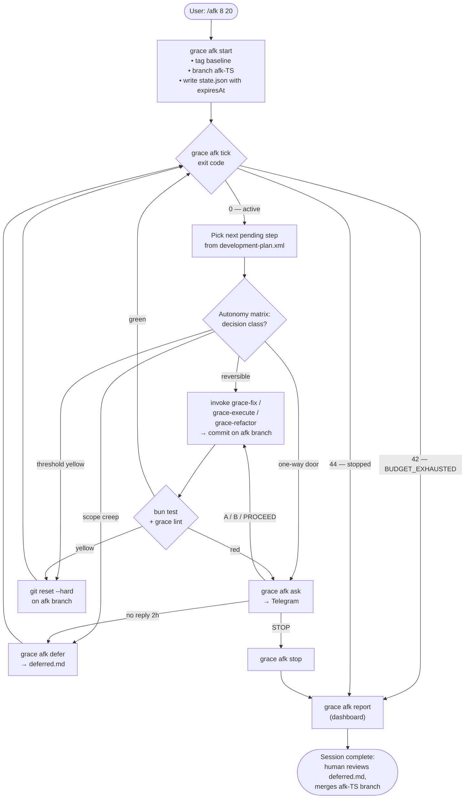

# `grace-afk` autopilot loop

Visual reference for the `grace-afk` skill (see `skills/grace/grace-afk/SKILL.md`).
GitHub renders the mermaid block inline.

## The loop

## How to read it

- **Rectangles** — actions (CLI commands, git operations).
- **Diamonds** — decision forks (tick gate, autonomy matrix, gates).
- The central **`grace afk tick` gate** is the "clock you cannot fast-forward": control returns
  there after every action. The CLI, not the LLM, decides when the session ends.
- The **red path through Telegram** is the only way out of autopilot mid-session: the agent only
  pages the human for genuinely irreversible decisions (one-way doors) or hard-red gate failures.
- **`deferred.md`** is the log of questions the agent chose not to answer. On return, the human
  reads it first, then merges the `afk-TS` branch.

## Related

- `skills/grace/grace-afk/SKILL.md` — protocol the agent follows inside the loop.
- `skills/grace/grace-ask-human/SKILL.md` — message format for the Telegram escalation box.
- `src/grace-afk.ts` — CLI wiring that owns the state transitions shown here.
- `src/afk/session.ts` — atomic state.json writes and the exit-code constants.
- `PLAN.md` → "PR-3 `grace-afk`" section — design rationale.
