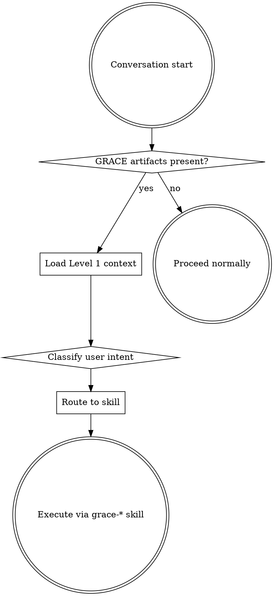

<SUBAGENT-STOP>
If you were dispatched as a subagent for a narrowly scoped task, skip this skill.
</SUBAGENT-STOP>

<EXTREMELY-IMPORTANT>
If a repository is managed by GRACE and you skip the activation protocol below, you WILL produce drift:
edits without knowledge-graph updates, fixes without verification-plan entries, refactors without CrossLink
maintenance. This is the #1 cause of GRACE projects degrading into "LLM forgot we had a graph" state.

IF YOU SEE GRACE ARTIFACTS, YOU MUST ACTIVATE THE PROTOCOL. THIS IS NOT OPTIONAL.
</EXTREMELY-IMPORTANT>

## What GRACE Is

GRACE (Graph-RAG Anchored Code Engineering) is a contract-first methodology. Every module has a
written contract (PCAM: Purpose, Constraints, Autonomy, Metrics), every change updates the
knowledge graph, and every module has a verification entry with explicit log/trace markers.
The `grace-*` skills are the ONLY way to modify a GRACE project correctly.

## When to Use

Invoke this skill at the start of ANY conversation where you might read, edit, or answer questions
about code. Check for GRACE activation markers:

1. `docs/knowledge-graph.xml` exists
2. `docs/development-plan.xml` exists
3. `docs/verification-plan.xml` exists
4. `AGENTS.md` contains GRACE keywords (knowledge-graph, MODULE_CONTRACT, verification-plan)
5. Project CLAUDE.md declares GRACE management

Presence of **any** of these means: **project is under GRACE governance → run protocol**.

## When NOT to Use

- You were spawned as a narrowly scoped subagent with a pre-set task (see `<SUBAGENT-STOP>` above).
- The repository has NO `docs/` with GRACE XML files AND no GRACE markers in `AGENTS.md` — this is
  not a GRACE project, proceed normally.
- The user explicitly instructs "ignore GRACE for this task" — honor the override, but log it.

## Activation Protocol



### Step 1 — Load Level 1 context (cheap, always)

Read at minimum:
- `AGENTS.md` (conventions, keywords, stack)
- `CLAUDE.md` if present (additional project rules)

If the optional `grace` CLI is installed, prefer:
```
grace status --path . --brief
```
This returns a ≤30-line snapshot (artifact health, module count, verification coverage, last
updated timestamps, next recommended action). Use this output as the primary orientation.

### Step 2 — Classify user intent

Map the incoming request to ONE of the categories below. Announce the routing decision to the
user in one sentence ("Routing to grace-fix because you described a runtime error").

| User intent | Route to |
|---|---|
| Question about the project, module, architecture, or behavior | `grace-ask` |
| Bug report, runtime error, unexpected behavior | `grace-fix` |
| New feature, architectural change, module addition | `grace-plan` (design) → `grace-execute` / `grace-multiagent-execute` (build) |
| Rename / move / split / merge existing code | `grace-refactor` |
| "Something feels stale / out of sync" | `grace-refresh` |
| Project health check, status, next steps | `grace-status` |
| "Is the code correct? Review the changes" | `grace-reviewer` |
| "How does GRACE work?" / methodology question | `grace-explainer` |
| Test / trace / log-marker design | `grace-verification` |
| Optimize architecture / choose between approaches | `grace-evolve` (when available) |
| Need CLI commands (lint, module find, file show) | `grace-cli` |

If intent is ambiguous, ask ONE clarifying question — but ONLY after Step 1 context is loaded.
Never ask clarifying questions with zero project context.

### Step 3 — Route to the skill and execute

Invoke the routed `grace-*` skill via the Skill tool (or the host equivalent). Do NOT attempt to
perform the operation with ad-hoc reads and edits: you will miss the graph / verification / contract
updates that the `grace-*` skills enforce.

## Common Rationalizations

Thoughts that mean STOP — you are about to skip GRACE activation and cause drift.

| Rationalization | Reality |
|---|---|
| "This is just a simple question, I'll answer from memory" | Questions are tasks. Without Level 1 context you will hallucinate module names. Run `grace status --brief` first. |
| "Let me read a file quickly to see what's here" | Files do not tell you the contract, the dependencies, or the verification story. The graph does. Read `AGENTS.md` first. |
| "The fix is a one-liner, skill overhead isn't worth it" | One-liners without CHANGE_SUMMARY and without verification-plan updates are how GRACE projects rot. Use `grace-fix`. |
| "I'll update the graph at the end" | You won't. By the time you finish, the graph deltas are no longer visible to you. Update in the same step. |
| "User just wants X, they don't care about GRACE overhead" | The user chose GRACE precisely to prevent this shortcut. If they truly want a bypass they will say so explicitly. |
| "I don't remember this skill, I'll freestyle" | Skills evolve. Read the current `grace-*` SKILL.md — do not rely on memory. |

## Red Flags

Stop immediately if any of these appear:

- You are about to use Edit/Write on a governed file without having read its MODULE_CONTRACT.
- You are about to delete a block that contains `START_BLOCK_*` markers without updating the graph.
- You are about to add a new dependency without recording it in MODULE_CONTRACT.DEPENDS.
- You are about to fix a bug without a regression entry in `docs/verification-plan.xml`.
- You are about to add a module and you have NOT invoked `grace-plan`.
- You have spent more than 2 minutes exploring files and have NOT yet loaded `AGENTS.md`.

Any of the above → return to Step 1.

## Verification

Before you exit this skill and hand off to a concrete `grace-*` skill, confirm:

- [ ] `AGENTS.md` is loaded into your working context (verification: state one concrete convention from it)
- [ ] `grace status --brief` output OR equivalent manual scan of `docs/*.xml` has been read (verification: state current module count or next recommended action)
- [ ] User intent has been classified and announced to the user (verification: one-sentence route decision)
- [ ] The chosen `grace-*` skill's SKILL.md has been invoked (verification: its prerequisites checklist has started)

If any box is unchecked, you have not yet activated GRACE and must not proceed to edits.

## Instruction Priority

This skill overrides default "answer fast" behavior in GRACE-managed repositories. The user's
explicit instructions always win over this skill. If `CLAUDE.md` says "do not use GRACE for this
task" or the user types `#no-grace`, honor that, but log the exception in your response.
